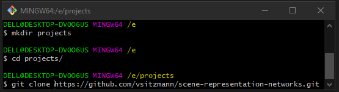
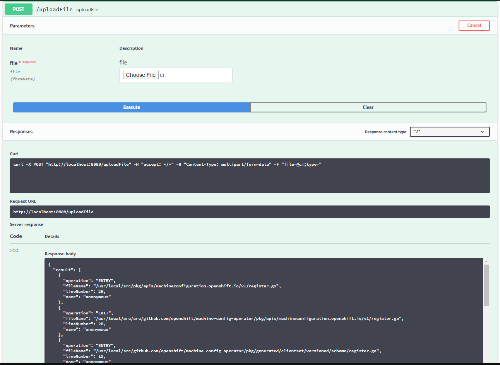
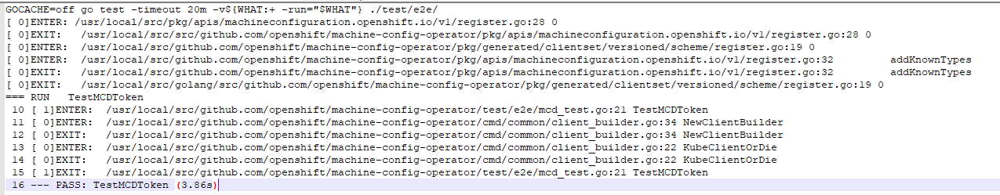
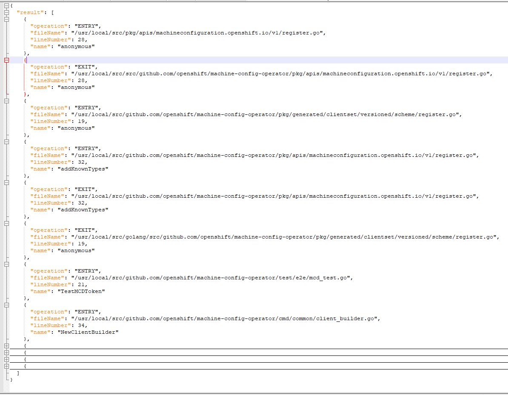

# Redhat-assignment
## Step1: open gitbash

## Step2: create a clone directory
```
mkdir projects/
```
## Step3: goto the clone directory
```
cd projects/
```
## Step4: clone the project
```
git clone https://github.com/vsitzmann/scene-representation-networks.git
```
## Step5: goto project firectory
```
cd Redhat-assignment/
```
## Step6: compile the project
```
mvn clean install
```
## Step7: run the project
```
mvn spring-boot:run
```
## Step8: Open browser and search below
```
http://localhost:8080
```
if Hello message appears, that means project is running fine
## Step8: Open Swagger or any Rest API client like Postman
```
http://localhost:8080/swagger-ui.html
```

## Step9: Click on Post, then click on tryout, then choose a file where log is given

## Step10: Click on Execute
You will get a response with response code 200 and response body with Json file

